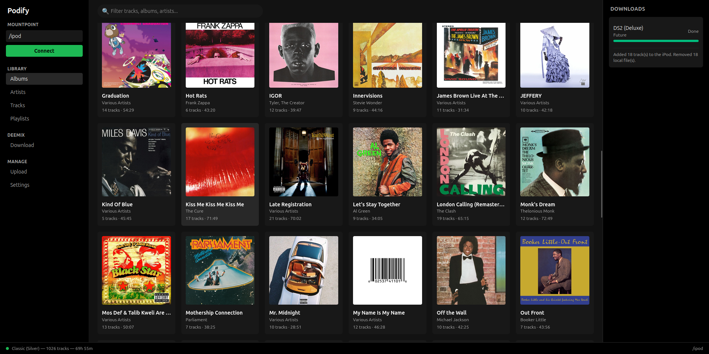

# Podify

Podify is a modern, Spotify-inspired web dashboard for browsing and managing music on an
**iPod Classic**. It pairs a React (Vite + TypeScript) single-page frontend with a Python/Flask
backend that talks to the iPod's iTunesDB via `gpod-utils`, and integrates
[deemix](https://gitlab.com/RemixDev/deemix-py) for searching and downloading music directly
into your library.

> Local-only tool. No authentication, no audio playback in the browser — it manages the device.



## Features

- **Library browsing** — tracks, artists, albums, playlists, and album art in a dark, Spotify-like UI.
- **Library management** — add/upload tracks, delete tracks, create/delete playlists, add/remove
  playlist tracks.
- **Deemix integration** — search Deezer for tracks/albums/artists, drill into an artist's albums
  and an album's songs, and download at configurable quality (FLAC / MP3 320 / MP3 128).
- **Automatic pipeline** — downloads land in your Music Directory, FLAC is converted to ALAC, and
  files are copied onto the iPod via `gpod-cp`. Staged downloads are removed once they're on the device.
- **Auto-sync** — optionally scan the Music Directory and import new FLAC files when an iPod connects.

## Architecture

```
React (Vite/TS) frontend  ──►  Flask API (app.py)
                                 ├─ ipod_service.py      iPod DB read/write via gpod-utils
                                 ├─ album_art.py         album art extraction
                                 ├─ flac2alac_converter  FLAC → ALAC
                                 ├─ auto_sync.py         Music Directory → iPod
                                 └─ deemix_routes.py     /api/deemix/* (deemix_service.py)
```

In production the frontend is built (`frontend/dist`) and served as static files by Flask.

## Run With Docker (recommended)

1. Mount your iPod on the host.
2. Create your environment file from the template and edit the paths:

   ```bash
   cp .env.example .env
   # edit .env: set IPOD_MOUNTPOINT and MUSIC_DIR_HOST
   ```

3. Build and start:

   ```bash
   sudo docker compose up --build -d --force-recreate
   ```

4. Open `http://localhost:8080`.
5. Enter mountpoint `/ipod` in the sidebar and click **Connect**.
6. In **Settings**, set the Music Directory to `/music`, and paste your Deezer ARL token to enable deemix.
7. Enable auto-sync if desired.

### Deezer ARL token (for deemix)

Downloading requires a Deezer ARL token. Add it in **Settings → Deezer ARL Token**. It is stored
server-side only (in `data/deemix_config.json`, which is gitignored) and never exposed back to the
frontend beyond a "configured" flag. **Never commit it.**

## Frontend development

The frontend lives in `frontend/`. For live development against a running backend:

```bash
cd frontend
npm install
npm run dev        # Vite dev server on http://localhost:5173, proxies /api to :8080
```

Build for production (what the Docker image runs):

```bash
npm run build      # outputs to frontend/dist
```

## Run Without Docker (Linux)

1. Install system dependencies:

   ```bash
   sudo apt-get update
   sudo apt-get install -y python3 python3-pip ffmpeg git autoconf automake libtool \
     build-essential pkg-config libglib2.0-dev libjson-c-dev libsqlite3-dev libgpod-dev \
     libavcodec-dev libavformat-dev libavutil-dev libswresample-dev libswscale-dev nodejs npm
   ```

2. Build and install `gpod-utils` (use this fork — its `gpod-ls` reports the artwork flag Podify expects):

   ```bash
   git clone --depth 1 https://github.com/MaxWilde/gpod-utils /tmp/gpod-utils
   cd /tmp/gpod-utils
   autoreconf --install && ./configure && make -j"$(nproc)" && sudo make install
   ```

3. Build the playlist helper:

   ```bash
   cd /path/to/Podify
   GPOD_PC=""; for C in gpod-1.0 libgpod libgpod-1.0 gpod; do pkg-config --exists "$C" && GPOD_PC="$C" && break; done
   gcc -O2 -Wall -Wextra -std=c11 $(pkg-config --cflags "$GPOD_PC" glib-2.0) \
     -o /usr/local/bin/gpod-playlistctl ./tools/gpod-playlistctl.c $(pkg-config --libs "$GPOD_PC" glib-2.0)
   ```

4. Install Python deps and build the frontend:

   ```bash
   python3 -m pip install -r requirements.txt
   cd frontend && npm install && npm run build && cd ..
   ```

5. Run the app:

   ```bash
   python3 app.py    # http://localhost:8080
   ```

## Environment variables

| Variable | Description | Default |
|----------|-------------|---------|
| `IPOD_MOUNTPOINT` | Host path where the iPod is mounted (→ `/ipod`) | `/media` |
| `MUSIC_DIR_HOST` | Host music/download directory (→ `/music`) | — (required) |
| `SETTINGS_DIR` | Host directory for persisted settings/state | `./data` |
| `HOST_IP` / `HOST_PORT` | Published bind address / port | `0.0.0.0` / `8080` |
| `APP_PORT` | Container port | `8080` |
| `DEEMIX_DOWNLOAD_SUBDIR` | Subfolder in `/music` for deemix downloads | `deemix` |
| `GUNICORN_THREADS` | Worker threads (single worker — see note) | `8` |

> The app runs as a **single gunicorn worker** because deemix job state is held in-process;
> concurrency is provided by threads instead.

## Tests

```bash
python3 -m unittest discover -s tests
```

## Credits

Built on [`gpod-utils`](https://github.com/whatdoineed2do/gpod-utils) and
[deemix](https://gitlab.com/RemixDev/deemix-py).
